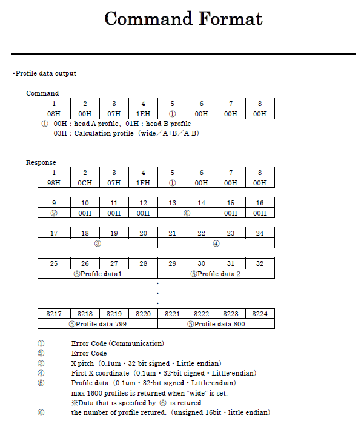
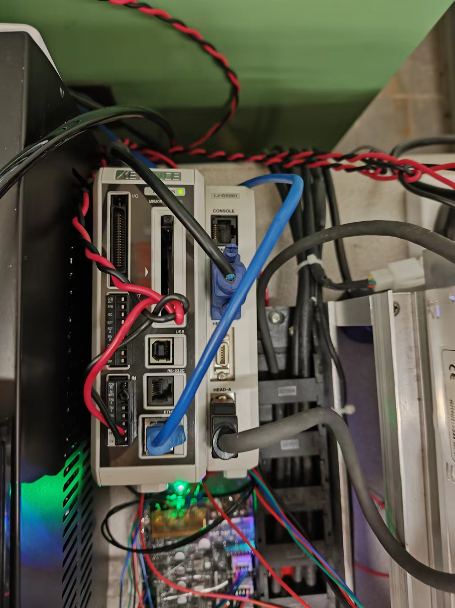
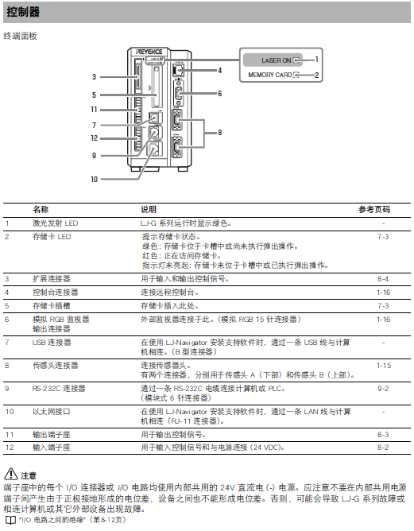
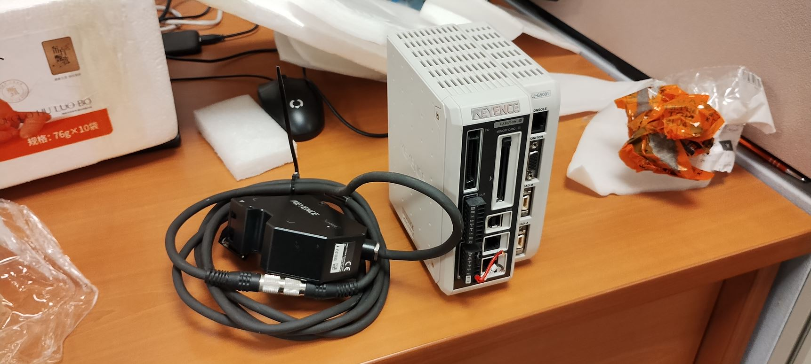
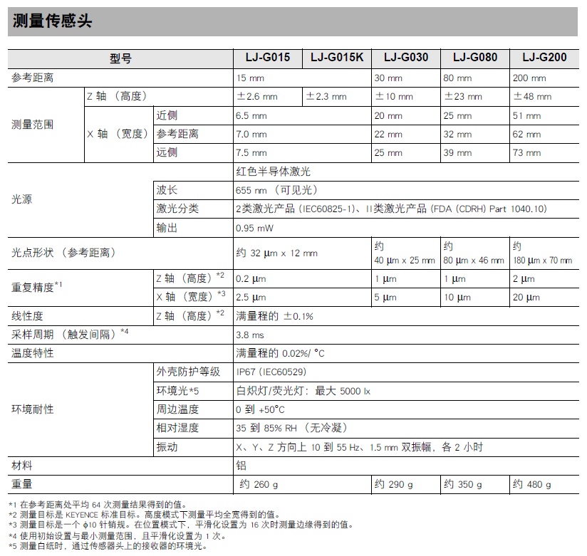

# Extrusion 3D printer with integrated laser profile sensor - in NUS

## 1 简介（Introduction）

2D激光轮廓传感器(2D Laser profile sensor)集成到3D打印机中以实现3D扫描，如下所示。

该系统由传感器、运动控制平台(motion control platform)和气动挤压系统(pneumatic extrusion system)组成，通过以太网(Ethernet)或串口(Serial Port)与PC机连接。

打印Gcode由开源切片软件生成，并由开源用户界面(UI)软件读取和发送。

打印时，命令由PC通过串口发送到控制板，在控制板(control board)上解码并执行。

在matlab中编写了一套实现扫描功能的程序。

扫描时需要运动与传感器的协调，PC通过串口控制运动平台移动一步，再通过以太网与传感器通讯获取截面，如此循环直至扫描完成。

图1 系统框图

### 如何从0开始搭建整个系统呢？

1. 购买/制造相应的组件，并按照设计进行装配
2. 确定各个端子的对应情况，并完成接线
3. 完成PC的环境准备、打印系统和扫描系统的配置
   1. 电脑环境的准备
   2. 打印和挤出系统的配置
   3. 扫描系统的配置

## 2 结构（Structure）

本节将介绍系统内部的主要结构。

### (1) 运动控制平台（Motion Control Platform）
运动控制平台是一个三轴钻床的基础上改装的。

图2 运动平台（原始） 

定制了如下组件

图3 改造示意图 

#### 1）安装板
介绍：安装在Z轴滑板上的安装板，将注射器针筒和2D轮廓传感器安装在它上面。

制造：3D打印（FDM），工程塑料。

模型 3D Model：[click to get stl file](<3Dmodels/STL/安装板 - PlanB.STL>)

#### 2）底座组件

介绍：由基板、调节装置和底座构成。

制造：底座材料为不锈钢，通过激光切割和折弯制造。其余部件可直接采购。

模型 3D Model：[click to get stl file](<3Dmodels/STL/底座.STL>)

图4 运动平台（改造后）

装配体 Assembly：[click to get stl file](<3Dmodels\STP\Assembly - Carriage-Z.STEP>)

### (2) 挤出系统（Extrusion System）
挤出系统由气压分配器和挤出装置构成。气泵可根据实验室条件选购。
#### 1）气压分配器（Pressure Dispenser）

图5 气压分配器

##### 技术指标：
1. 吐出方式：16种自由设定方式、带吐出时间显示*
2. 自动定时吐出：00.01S-99.99S
3. 吐出间隔时间：0.1-9.9S（自动定时功能）
4. 输入电压：220V±10% 50Hz/110V±10% 60Hz
5. 内部电压：12VDC/24VDC
6. 输入气压：10-100pSi
7. 输出气压：1-80 pSi
8.  外形尺寸：235×225×63mm
9.  重量：2.8kg
##### 使用安装说明:
位于背部的SETUP四位吐出时间编程器拨码开关，通过拨动其可作16种出方式选择模式组合设定如下：
<table>
<capital>模式组合</capital>
<tr>
<th rowspan=2 align="center">序号</th>
<th colspan=4 align="center"> 模式开关状态</th>
<th rowspan=2 align="center">吐出方式及工作对应功能</th>
</tr>
<tr>
<th align="center">S1</th>
<th align="center">S2</th>
<th align="center">S3</th>
<th align="center">S4</th>
</tr>
<tr>
<th align="center">1</th>
<th align="center">Off</th>
<th align="center">Off</th>
<th align="center">Off</th>
<th align="center">Off</th>
<th align="left">  点动模式，按下/踩下并保持以维持挤出</th>
</tr>
<tr>
<th align="center">2</th>
<th align="center">On</th>
<th align="center">Off</th>
<th align="center">On</th>
<th align="center">On</th>
<th align="left">  保持模式，按下/踩下1次开关，按照设定的时间持续挤出；再按下/踩下1次开关停止挤出。</th>
</tr>
<tr>
<th align="center">3</th>
<th align="center">Off</th>
<th align="center">On</th>
<th align="center">On</th>
<th align="center">On</th>
<th align="left">  点动计时模式，按下/踩下并保持以维持挤出设定的时间</th>
</tr>
<tr>
<th align="center">4</th>
<th align="center">On</th>
<th align="center">On</th>
<th align="center">On</th>
<th align="center">On</th>
<th align="left">  按照设定的时间自动定时连续挤出</th>
</tr>
<tr>
<th align="center">5</th>
<th align="center">On</th>
<th align="center">Off</th>
<th align="center">Off</th>
<th align="center">Off</th>
<th align="left">  按下/踩下1次开关，按设定时间挤出1次。</th>
</tr>
<tr>
<th align="center">6</th>
<th align="center">Off</th>
<th align="center">On</th>
<th align="center">Off</th>
<th align="center">Off</th>
<th align="left">  按下/踩下1次开关，按设定时间挤出2次。</th>
</tr>
<tr>
<th align="center">7</th>
<th align="center">On</th>
<th align="center">On</th>
<th align="center">Off</th>
<th align="center">Off</th>
<th align="left">  按下/踩下1次开关，按设定时间挤出3次。</th>
</tr>
<tr>
<th align="center">8</th>
<th align="center">Off</th>
<th align="center">Off</th>
<th align="center">On</th>
<th align="center">Off</th>
<th align="left">  按下/踩下1次开关，按设定时间挤出4次。</th>
</tr>
<tr>
<th align="center">9</th>
<th align="center">On</th>
<th align="center">Off</th>
<th align="center">On</th>
<th align="center">Off</th>
<th align="left">  按下/踩下1次开关，按设定时间挤出5次。</th>
</tr>
<tr>
<th align="center">10</th>
<th align="center">Off</th>
<th align="center">On</th>
<th align="center">On</th>
<th align="center">Off</th>
<th align="left">  按下/踩下1次开关，按设定时间挤出6次。</th>
</tr>
<tr>
<th align="center">11</th>
<th align="center">On</th>
<th align="center">On</th>
<th align="center">On</th>
<th align="center">Off</th>
<th align="left">  按下/踩下1次开关，按设定时间挤出7次。</th>
</tr>
<tr>
<th align="center">12</th>
<th align="center">Off</th>
<th align="center">Off</th>
<th align="center">Off</th>
<th align="center">On</th>
<th align="left">  按下/踩下1次开关，按设定时间挤出8次。</th>
</tr>
<tr>
<th align="center">13</th>
<th align="center">On</th>
<th align="center">Off</th>
<th align="center">Off</th>
<th align="center">On</th>
<th align="left">  按下/踩下1次开关，按设定时间挤出9次。</th>
</tr>
<tr>
<th align="center">14</th>
<th align="center">Off</th>
<th align="center">On</th>
<th align="center">Off</th>
<th align="center">On</th>
<th align="left">  按下/踩下1次开关，按设定时间挤出10次。</th>
</tr>
<tr>
<th align="center">15</th>
<th align="center">On</th>
<th align="center">On</th>
<th align="center">Off</th>
<th align="center">On</th>
<th align="left">  按下/踩下1次开关，按设定时间挤出11次。</th>
</tr>
<tr>
<th align="center">16</th>
<th align="center">Off</th>
<th align="center">Off</th>
<th align="center">On</th>
<th align="center">On</th>
<th align="left">  按下/踩下1次开关，按设定时间挤出12次。</th>
</tr>
</table>

实际使用的模式为序号1.

##### 操作：
1. 调压：通过调节黑色旋钮调节气压
2. 开关：可以按下左侧红色小按钮进行手动调节，也可以外接踏板手动调节（这个接口被改造用于程序控制）；控制方式在手册中有详细说明。
##### 参考资料
1. [手册](Docs/JND-983A点胶机详细功能设置.docx)

#### 2） 注射器针筒
##### 三维模型
1. [针筒](3Dmodels/SLDPRT/syringe.zip)
2. [喷嘴](3Dmodels/SLDPRT/tips.rar)
##### 手册
1. [喷嘴型号](Docs/技术表格.pdf)

### (3) 2D激光轮廓传感器（2D laser profile sensor）

图6 激光轮廓传感器

#### a. 概况：
使用的是基恩士2D激光轮廓传感器，驱动器型号为LJ-G5001，传感器型号为LJ-G030.

##### i. 驱动器：
驱动器基本安装尺寸如下所示：

.png>)

##### ii. 传感器：
1. 安装尺寸：

2. 测量原理及测量范围
激光轮廓传感器采用激光三角反射式原理：激光束被放大形成一条激光线投射到被测物体表面上，反射光透过高质量光学系统，被投射到成像矩阵上，经过计算得到传感器到被测表面的距离（Z 轴）和沿着激光线的位置信息（X 轴）。移动被测物体或轮廓仪探头，就可以得到一组三维测量值。

对于LJ-G030侧头，其有效测量区域为一个梯形，如下图所示：

.png>)

Z向测量范围：侧头下方30mm ± 10 mm；X向测量范围为 ±11 mm。

3. 测量精度：
Z向测量精度：1 μm. X向测量精度：5 μm。

#### b. 通讯方式：

USB、串口、以太网。其中只有以太网通讯可以定制化传输轮廓数据。其他详情参见手册。
这里展示部分内容：

.png>)

#### 相关资料：
1. [用户手册](<Docs/01 AS_79826_LJ-G_UM_96M13960_CN_1059-7.pdf>)
2. [以太网通讯协议](<Docs/01 LJG5000_LAN.pdf>)
3. [LJ-G015 3D模型](Docs/LJ-G015(K)_2.x_t)
4. [LJ-G030 3D模型](Docs/LJ-G030_2.x_t)

## 3 硬件 Hardware

这一节主要介绍接线和相关电路。

This section mainly introduces the wiring and related circuits.

### (1) 控制板 Control borard

图7 控制板接口图 Figure 7 Control panel interface diagram

使用的控制板品牌为：，型号为：。
控制板相关信息的网页：。
芯片为：。
支持的固件包括：。

### (2) 传感器驱动器 Sensor Driver

 
 
 

图8 激光轮廓传感器驱动器 Figure 8 Laser profile sensor driver

接线方式参见上图 See the figure above for wiring method：

①激光轮廓传感器需要接直流电源，电压为24V。The laser profile sensor needs to be connected to a DC power supply with a voltage of 24V.

②可接显示器(VGA)观察轮廓信息。Can be connected to a monitor (VGA) to observe profile information.

③以太网口连接到路由器上从而与PC连接。The Ethernet port is connected to the router and then connected to the PC.

④传感器连接线。Sensor connection cable.

### (3) 电源 Power

图9 直流电源 Figure 9 DC power supply

24V XXW直流电源

### (4) 步进电机 Step Motors
57步进电机 57 Stepper Motor
其接线方式如下：

图9 步进电机接线图 Figure 9 Stepper motor wiring diagram

### (5) 限位开关 Endstops
光电传感器，型号
手册：

图10 限位开关接线图 Figure 10 Limit switch wiring diagram

### (6) Hotbed
热床尺寸为

图11 热床接线图 Figure 11 Hot bed wiring diagram

### (4) Pressure switch control
气压开关控制由电磁继电器实现，其接线图如下：

The air pressure switch control is realized by an electromagnetic relay, and its wiring diagram is as follows:

图12 气压开关控制接线图 Figure 12 Air pressure switch control wiring diagram

## 4 Firmware - Marlin
Marlin是最常用的开源3D打印固件，我们对其进行了相应修改，以满足设备使用：

Marlin is the most commonly used open source 3D printing firmware, and we modified it accordingly to meet the needs of the device.

XXXXXX

Marlin官网：
原始Marlin资源：
定制Marlin资源：

## 5 软件 Software
这里分享使用的相关软件：

Here are the related software used:

### （1）切片软件 Slicing software
#### 1）Slic3r
Slic3r是款开源切片软件，但是其已经停止开发了，所以存在一些bug。

Slic3r is an open source slicing software, but it has stopped development, so there are some bugs.

官网：

图13 Slic3r界面

#### 2）sssss

是Slic3r的一个分支，目前仍然在开发，并且其社区相对活跃。

It is a fork of Slic3r and is still under development with a relatively active community.

图14 Slic3r界面

### （2）用户界面 user interface：Printerun

官网：

图15 界面

### （3）LJ-Navigator

基恩士激光轮廓传感器的官方软件，可以用来测试传感器和配置相关参数。

The official software of KEYENCE laser profile sensors can be used to test sensors and configure related parameters.

图16 界面

### （4）CAXA 电子图版 2018 （中文版）
用于绘制打印、扫描轨迹。

Used to draw print and scan tracks.

## 6 配置
### 电脑环境的配置
### 打印和挤出系统的配置
### 扫描系统的配置

## 7 程序和代码

## 8 Example (How to use)
### （1）打印一个立方体
### （2）获得一个截面轮廓
### （3）按照指定轨迹获取轮廓
### （4）设计打印轨迹并在打印后扫描，然后输出点云文件
