# Extrusion 3D printer with integrated laser profile sensor - in NUS

[TOC]


## 一、简介（Introduction）

2D激光轮廓传感器(2D Laser profile sensor)集成到3D打印机中以实现3D扫描，如下所示。

该系统由传感器、运动控制平台(motion control platform)和气动挤压系统(pneumatic extrusion system)组成，通过以太网(Ethernet)或串口(Serial Port)与PC机连接。

打印Gcode由开源切片软件生成，并由开源用户界面(UI)软件读取和发送。

打印时，命令由PC通过串口发送到控制板，在控制板(control board)上解码并执行。

在matlab中编写了一套实现扫描功能的程序。

扫描时需要运动与传感器的协调，PC通过串口控制运动平台移动一步，再通过以太网与传感器通讯获取截面，如此循环直至扫描完成。


图1 系统框图

### 如何从0开始搭建整个系统呢？

1. 购买/制造相应的组件，并按照设计进行装配
2. 确定各个端子的对应情况，并完成接线
3. 完成PC的环境准备、打印系统和扫描系统的配置
   1. 电脑环境的准备
   2. 打印和挤出系统的配置
   3. 扫描系统的配置

## 二、结构（Structure）

本节将介绍系统内部的主要结构。

### (1) 运动控制平台（Motion Control Platform）
运动控制平台是一个三轴钻床的基础上改装的。


图2 运动平台（原始） 

定制了如下组件：


图3 改造示意图 

#### 1）安装板
介绍：安装在Z轴滑板上的安装板，将注射器针筒和2D轮廓传感器安装在它上面。

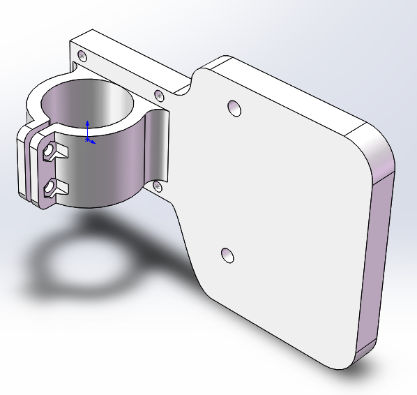

制造：3D打印（FDM），工程塑料。

模型 3D Model：[click to get stl file](<3Dmodels/STL/安装板 - PlanB.STL>)

#### 2）底座组件

介绍：由基板、调节装置和底座构成。

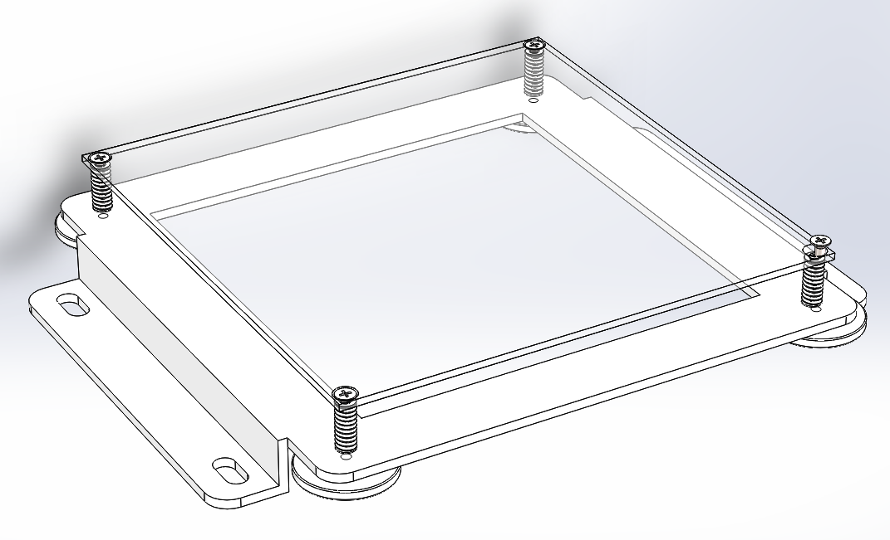
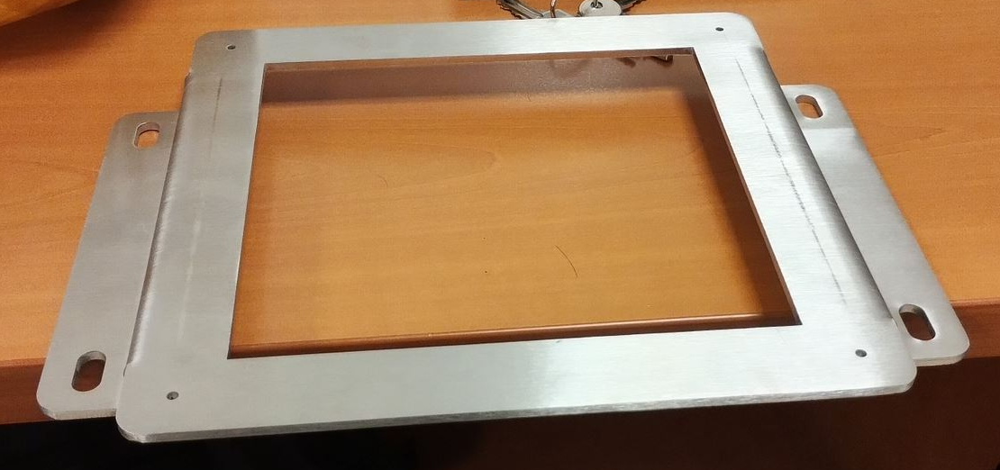

制造：底座材料为不锈钢，通过激光切割和折弯制造。其余部件可直接采购。

模型 3D Model：[click to get stl file](<3Dmodels/STL/底座.STL>)

#### 3）装配体

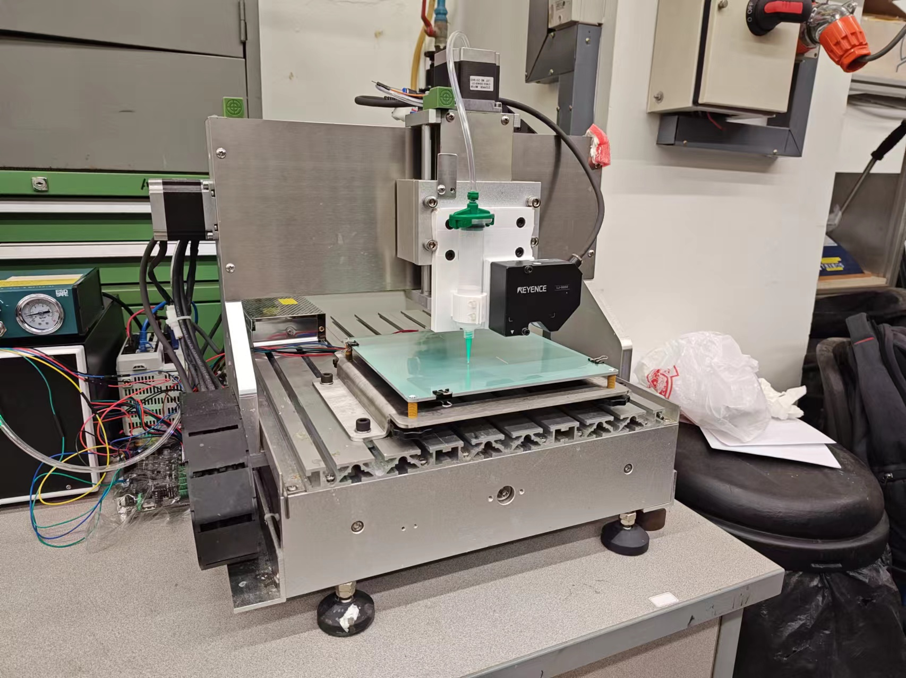

图4 运动平台（改造后）

装配体 Assembly：[click to get stl file](<3Dmodels\STP\Assembly - Carriage-Z.STEP>)

### (2) 挤出系统（Extrusion System）
挤出系统由气压分配器和挤出装置构成。气泵可根据实验室条件选购。
#### 1）气压分配器（Pressure Dispenser）
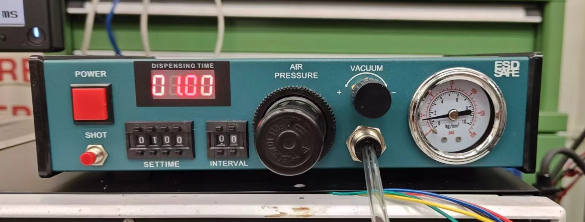

图5 气压分配器

##### 技术指标：
1. 吐出方式：16种自由设定方式、带吐出时间显示*
2. 自动定时吐出：00.01S-99.99S
3. 吐出间隔时间：0.1-9.9S（自动定时功能）
4. 输入电压：220V±10% 50Hz/110V±10% 60Hz
5. 内部电压：12VDC/24VDC
6. 输入气压：10-100pSi
7. 输出气压：1-80 pSi
8.  外形尺寸：235×225×63mm
9.  重量：2.8kg
##### 使用安装说明:
位于背部的SETUP四位吐出时间编程器拨码开关，通过拨动其可作16种出方式选择模式组合设定如下：
<table>
<capital>模式组合</capital>
<tr>
<th rowspan=2 align="center">序号</th>
<th colspan=4 align="center"> 模式开关状态</th>
<th rowspan=2 align="center">吐出方式及工作对应功能</th>
</tr>
<tr>
<th align="center">S1</th>
<th align="center">S2</th>
<th align="center">S3</th>
<th align="center">S4</th>
</tr>
<tr>
<th align="center">1</th>
<th align="center">Off</th>
<th align="center">Off</th>
<th align="center">Off</th>
<th align="center">Off</th>
<th align="left">  点动模式，按下/踩下并保持以维持挤出</th>
</tr>
<tr>
<th align="center">2</th>
<th align="center">On</th>
<th align="center">Off</th>
<th align="center">On</th>
<th align="center">On</th>
<th align="left">  保持模式，按下/踩下1次开关，按照设定的时间持续挤出；再按下/踩下1次开关停止挤出。</th>
</tr>
<tr>
<th align="center">3</th>
<th align="center">Off</th>
<th align="center">On</th>
<th align="center">On</th>
<th align="center">On</th>
<th align="left">  点动计时模式，按下/踩下并保持以维持挤出设定的时间</th>
</tr>
<tr>
<th align="center">4</th>
<th align="center">On</th>
<th align="center">On</th>
<th align="center">On</th>
<th align="center">On</th>
<th align="left">  按照设定的时间自动定时连续挤出</th>
</tr>
<tr>
<th align="center">5</th>
<th align="center">On</th>
<th align="center">Off</th>
<th align="center">Off</th>
<th align="center">Off</th>
<th align="left">  按下/踩下1次开关，按设定时间挤出1次。</th>
</tr>
<tr>
<th align="center">6</th>
<th align="center">Off</th>
<th align="center">On</th>
<th align="center">Off</th>
<th align="center">Off</th>
<th align="left">  按下/踩下1次开关，按设定时间挤出2次。</th>
</tr>
<tr>
<th align="center">7</th>
<th align="center">On</th>
<th align="center">On</th>
<th align="center">Off</th>
<th align="center">Off</th>
<th align="left">  按下/踩下1次开关，按设定时间挤出3次。</th>
</tr>
<tr>
<th align="center">8</th>
<th align="center">Off</th>
<th align="center">Off</th>
<th align="center">On</th>
<th align="center">Off</th>
<th align="left">  按下/踩下1次开关，按设定时间挤出4次。</th>
</tr>
<tr>
<th align="center">9</th>
<th align="center">On</th>
<th align="center">Off</th>
<th align="center">On</th>
<th align="center">Off</th>
<th align="left">  按下/踩下1次开关，按设定时间挤出5次。</th>
</tr>
<tr>
<th align="center">10</th>
<th align="center">Off</th>
<th align="center">On</th>
<th align="center">On</th>
<th align="center">Off</th>
<th align="left">  按下/踩下1次开关，按设定时间挤出6次。</th>
</tr>
<tr>
<th align="center">11</th>
<th align="center">On</th>
<th align="center">On</th>
<th align="center">On</th>
<th align="center">Off</th>
<th align="left">  按下/踩下1次开关，按设定时间挤出7次。</th>
</tr>
<tr>
<th align="center">12</th>
<th align="center">Off</th>
<th align="center">Off</th>
<th align="center">Off</th>
<th align="center">On</th>
<th align="left">  按下/踩下1次开关，按设定时间挤出8次。</th>
</tr>
<tr>
<th align="center">13</th>
<th align="center">On</th>
<th align="center">Off</th>
<th align="center">Off</th>
<th align="center">On</th>
<th align="left">  按下/踩下1次开关，按设定时间挤出9次。</th>
</tr>
<tr>
<th align="center">14</th>
<th align="center">Off</th>
<th align="center">On</th>
<th align="center">Off</th>
<th align="center">On</th>
<th align="left">  按下/踩下1次开关，按设定时间挤出10次。</th>
</tr>
<tr>
<th align="center">15</th>
<th align="center">On</th>
<th align="center">On</th>
<th align="center">Off</th>
<th align="center">On</th>
<th align="left">  按下/踩下1次开关，按设定时间挤出11次。</th>
</tr>
<tr>
<th align="center">16</th>
<th align="center">Off</th>
<th align="center">Off</th>
<th align="center">On</th>
<th align="center">On</th>
<th align="left">  按下/踩下1次开关，按设定时间挤出12次。</th>
</tr>
</table>

实际使用的模式为序号1.

##### 操作：
1. 调压：通过调节黑色旋钮调节气压
2. 开关：可以按下左侧红色小按钮进行手动调节，也可以外接踏板手动调节（这个接口被改造用于程序控制）；控制方式在手册中有详细说明。
##### 参考资料
1. [手册](Docs/JND-983A点胶机详细功能设置.docx)

#### 2） 注射器针筒
##### 三维模型
1. [针筒](3Dmodels/SLDPRT/syringe.zip)
2. [喷嘴](3Dmodels/SLDPRT/tips.rar)
##### 手册
1. [喷嘴型号](Docs/技术表格.pdf)

### (3) 2D激光轮廓传感器（2D laser profile sensor）

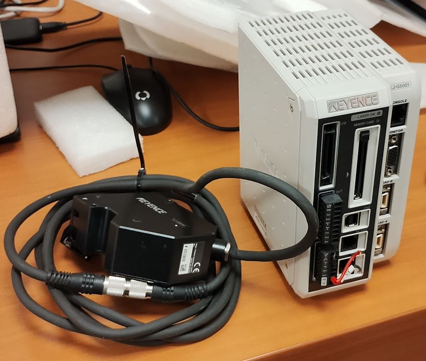

图6 激光轮廓传感器

#### a. 概况：
使用的是基恩士2D激光轮廓传感器，驱动器型号为LJ-G5001，传感器型号为LJ-G030.

##### i. 驱动器：
驱动器基本安装尺寸如下所示：

.png>)

##### ii. 传感器：
1. 安装尺寸：


2. 测量原理及测量范围
激光轮廓传感器采用激光三角反射式原理：激光束被放大形成一条激光线投射到被测物体表面上，反射光透过高质量光学系统，被投射到成像矩阵上，经过计算得到传感器到被测表面的距离（Z 轴）和沿着激光线的位置信息（X 轴）。移动被测物体或轮廓仪探头，就可以得到一组三维测量值。


对于LJ-G030侧头，其有效测量区域为一个梯形，如下图所示：

.png>)

Z向测量范围：侧头下方30mm ± 10 mm；X向测量范围为 ±11 mm。

3. 测量精度：
Z向测量精度：1 μm. X向测量精度：5 μm。


#### b. 通讯方式：

USB、串口、以太网。其中只有以太网通讯可以定制化传输轮廓数据。其他详情参见手册。
这里展示部分内容：

.png>)

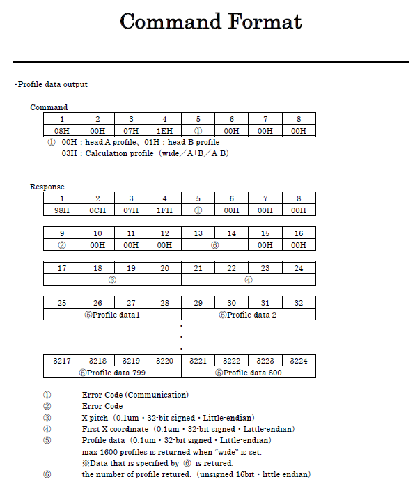

#### 相关资料：
1. [用户手册](<Docs/01 AS_79826_LJ-G_UM_96M13960_CN_1059-7.pdf>)
2. [以太网通讯协议](<Docs/01 LJG5000_LAN.pdf>)
3. [LJ-G015 3D模型](Docs/LJ-G015(K)_2.x_t)
4. [LJ-G030 3D模型](Docs/LJ-G030_2.x_t)

## 三、硬件（Hardware）

这一节主要介绍接线和相关电路。

### (1) 控制板 Control borard
控制板采用了[创客基地(MakerBase)](https://makerbase.com.cn/)的[MKS-Monster8](https://github.com/makerbase-mks/MKS-Monster8)控制板。该控制板支持Marlin、Klipper等主流3D打印固件。

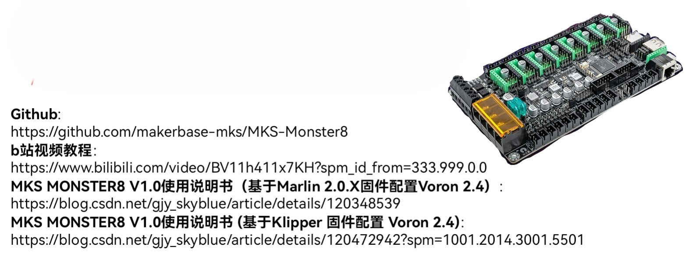

基本技术参数如下：
- MCU: STM32F407VET6, 168MHz, 512K flash, 192KB RAM
- 供电：DC12-24V input(2 MP1584EN Output DC12V(For FANs) and DC5V)
- 3 PWM FANs + 3 power output(all power can be select by jumper and select VIN, dc12V, dc5V)
- axis drivers and 9 motor interface(Driver0,1,2-1,2-2,3,4,5,6,7)
- EXP1,EXP2 support MKS MINI12864,MKS TS35,LCD12864,LCD2004
- USART(usart1:PA9,PA10) support MKS H43 or for other serial communication
- 6 endstop support power select(X-,X+,Y-,Y+,Z-,Z+) and 3D TOUCH(PA8) interface
- 4K eeprom on board(connect to I2C)
- Built-in CAN transceiver and interface(connect to CAN)
- Integrated SPI communication microsd card and reserved SPI signal interface
- Integrated UDISK
- Integrated virtural USB device
- Support TMC UART and SPI mode, SENSORLESS_HOMING function(Diag0-5,connect to X-,Y-,Z-,X+,Y+,Z+)
- Support driver power select(5V or 3.3V)
- Has TVS power spike protection
- Possess power reverse connection protection function
- Support DFU mode set by button(Boot0)


但是，我们的平台需要使用的为X、Y、Z三轴的控制、无挤出加热需求、预留基板(substrate)的加热板(hot bed)，将风扇控制口留作气压开关(switch)控制，限位开关。综合上述考虑，大体的接线方案如下：

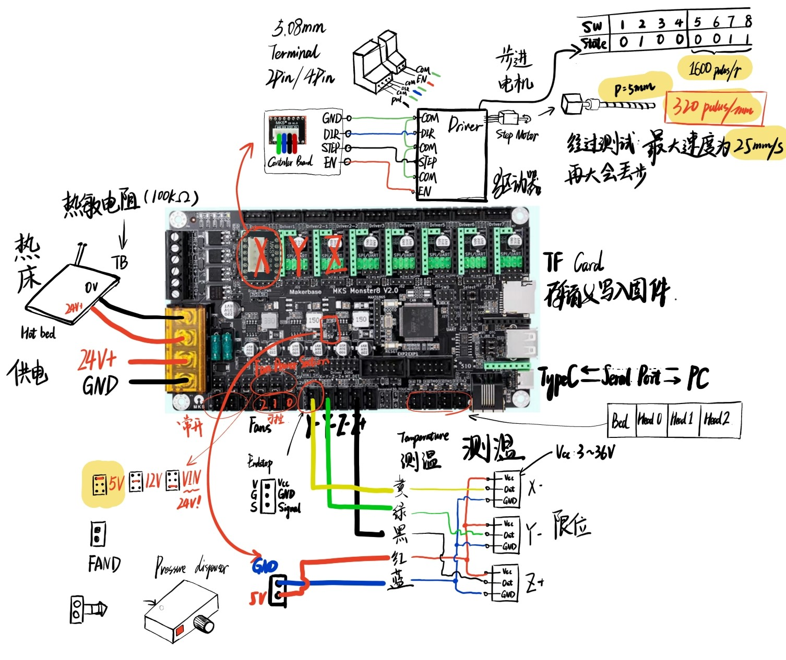

接线图

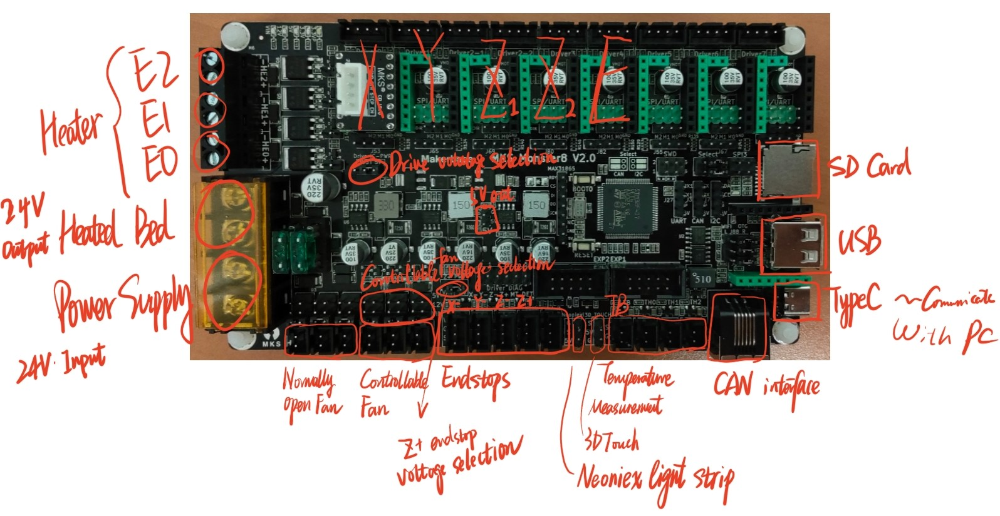

接线图-补充

接下来我将结合这个整体接线图来说明各个部分是如何连接到控制板上的。

### (2) 电源 
电源用的就是很常见的220V交流输入，24V直流输出的电源。

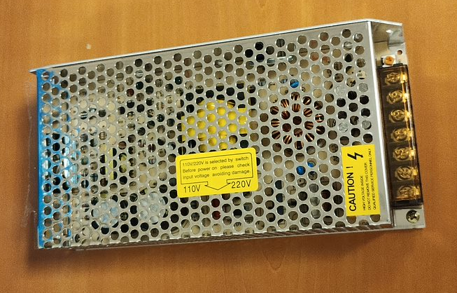

图9 直流电源 Figure 9 DC power supply

### (3) 步进电机 Step Motors

所使用的点击为57步进电机。

步进电机首先与驱动器相连，驱动器需要接电源，并与控制板相连。

其控制方式为位置控制模式，即每发送一个脉冲，步进电机根据驱动器的设定转动特定的角度。对于57步进电机来说，步距角θ为0.8°（即1个脉冲对应电机轴转动0.8°），驱动可以设置系分数n，从而使得步距角变为θ/n，从而提高运动精度。只不过这种提升也是有限度的，通常认为细分数大于32时，对精度提升的效果会变得有限，细分数高于32时，主要的贡献在于提高运动的平稳性。

#### 驱动器

所使用的驱动器没有看到品牌和型号，但是将其设置面板抄了下来：

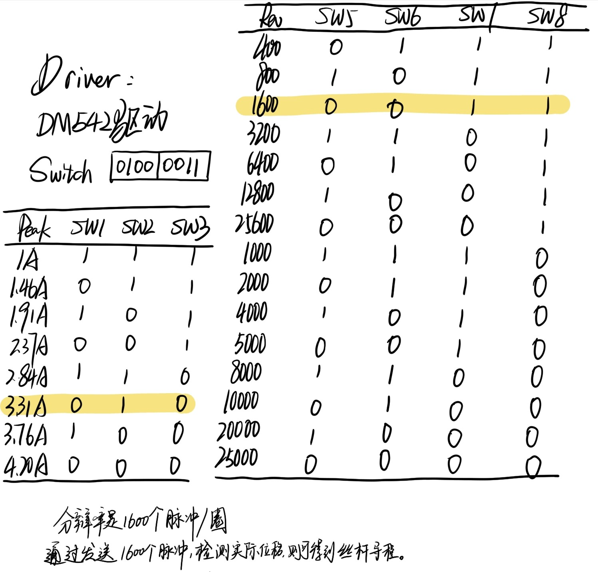

可以通过调整驱动器的拨码开关来调整电流峰值和细分数。突出显示的是原有配置，我沿用了该配置。

#### 接线

原先的接线方式如下：

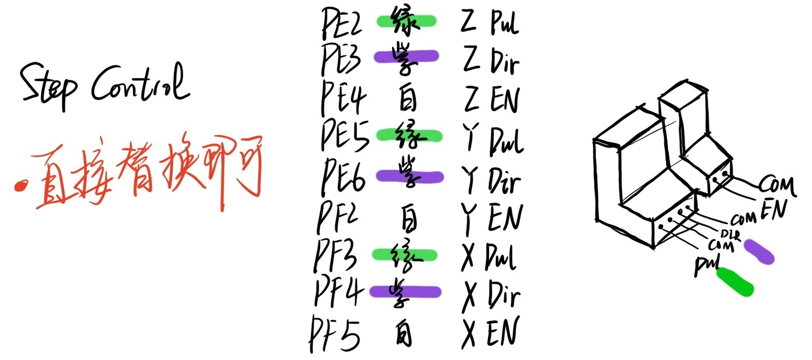

参照原有接线方式进行接线。需要指出的是，使用了一个转接板直插到控制板上，然后再进行接线，公共端（COM）接地，其他的包括使能（Enable）、脉冲（Pulus）、方向（Direction）。并且线缆颜色与下图一一对应：

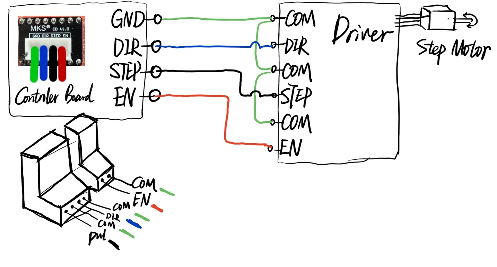

### (4) 限位开关 Endstops

光电传感器，型号未知。根据原有接线方案调整：


在实际调试过程中，发现原有的vcc 5V无法满足使用需要，有时候会出现电压不足的问题，且传感器上标识的工作电压为0~24V，因此选用24V电压作为供电。

可以在概览图中看到，在“接线图-补充”中，提到了Z+ endstop voltage selection, 在这里调整条线接法就能调整施加电压。

### (5) Hotbed
热床尺寸为210mm × 210mm

参考“接线图”进行接线即可，另外热床上有一个100k热敏电阻，需要借到“接线图-补充”中的TB处。

### (6) Pressure switch control

气压开关控制通过Controllable Fan端口控制，电压调整为24V，并接到继电器模块上，另外一端接到气压分配器(pressure dispenser)上，进而进行气压的开关控制(switch control)。

### (7) 传感器驱动器 Sensor Driver

.png>)

驱动器的接线方式参见上图：

①激光轮廓传感器需要接直流电源，电压为24V。

②可接显示器(VGA)观察轮廓信息。

③以太网口连接到路由器上从而与PC连接。也预留USB、RS232可以连接PC。

④传感器连接线。

## 四、Firmware - Marlin
[Marlin](https://marlinfw.org/)是最常用的开源3D打印固件，我们对其进行了相应修改，以满足设备使用：

1. 启用G05样条插补
2. 启用XYZ3个轴，并设定脉冲当量（每个轴移动1mm对应的脉冲数）
3. 关闭挤出机冷挤出限制（禁用温度传感器，设置最低挤出温度为0℃）
4. 按照实际行程范围调整配置打印范围。
5. 设置回零方向为X-，Y-，Z+

编程环境：VScode环境下使用PlatformIO插件。

Marlin官网：https://marlinfw.org/

原始Marlin资源：https://github.com/MarlinFirmware/Configurations/tree/release-2.1.2.4

定制Marlin资源：https://lecloud.lenovo.com/share/2JQMt9CWcRS9uVE4x （密码：pgjg）

## 五、软件 Software
这里分享使用的相关软件：

### （1）切片软件 Slicing software
#### 1）Slic3r
Slic3r是款开源切片软件，但是其已经停止开发了，所以存在一些bug。

官网：https://slic3r.org/

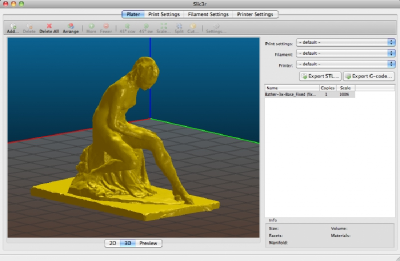

图13 Slic3r界面

#### 2）PrusaSlicer

是Slic3r的一个分支，目前仍然在开发，并且其社区相对活跃。之前使用Slic3r，但是因为BUG太多，现在已经转为使用PrusaSlicer。

官网：https://www.prusa3d.com/page/prusaslicer_424/

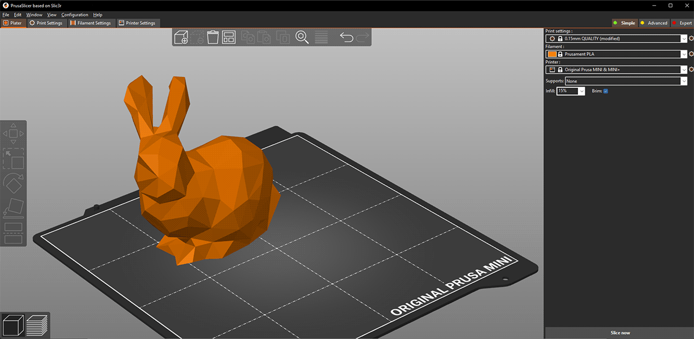

图14 PrusaSlicer界面

### （2）用户界面 user interface：pronterface   

官网：https://www.pronterface.com/

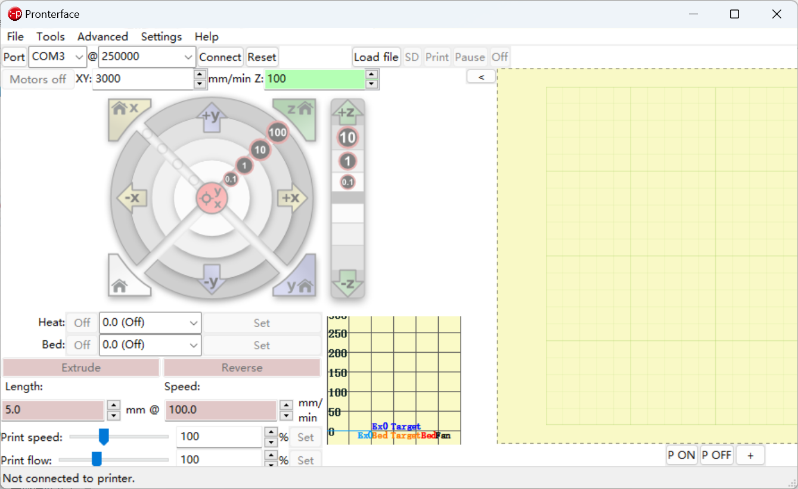

图15 界面

### （3）LJ-Navigator

基恩士激光轮廓传感器的官方软件，可以用来测试传感器和配置相关参数。

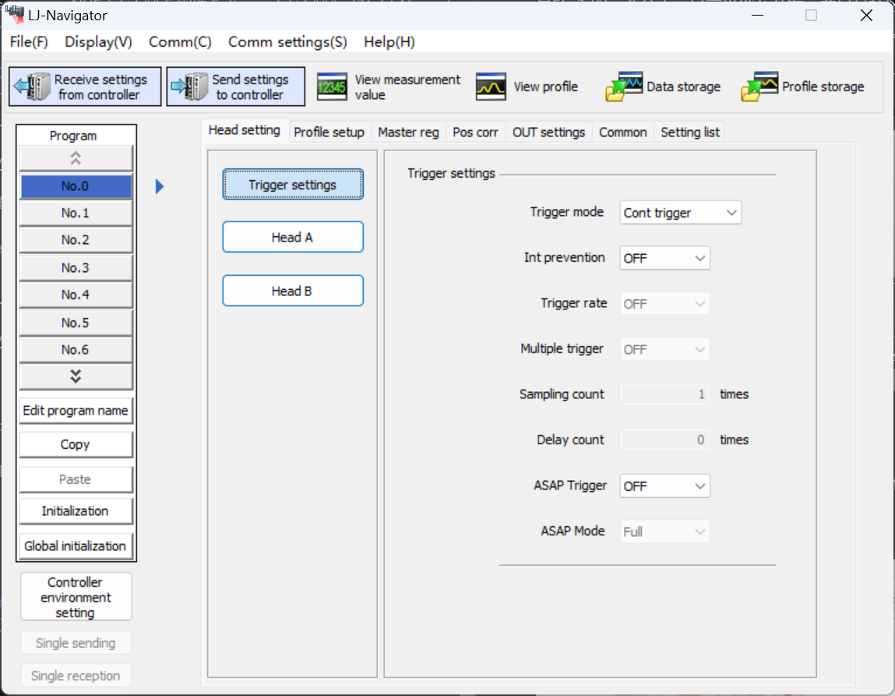

图16 界面

安装包：[LJ-Navigator](Docs/基恩士软件.rar)

### （4）CAXA 电子图版 2018 （中文版）
用于绘制打印、扫描轨迹

## 六、配置
### 1. 电脑环境的配置
系统：Windows 7/8/10/11都可以
软件：PrusaSlicer、pronterface、LJ-Navigator、CAXA、MATLAB。

### 2. 打印和挤出系统的配置
### （1）连接：

​	将PC和控制板连接起来
### （2）确认端口号：

​	此电脑[右击]→管理[打开“计算机管理”]→点击设备管理器→查看端口（找到连接控制板后新出现的端口，记住它）

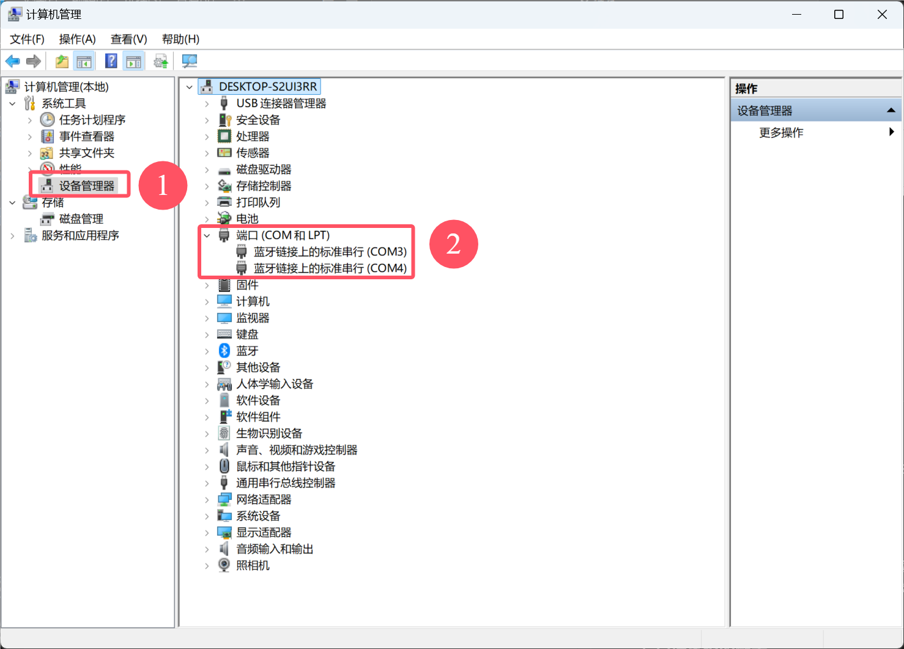

### （3）通讯：

​	打开"pronterface"然后选择刚才的端口号，配置波特率（默认250000）→连接
​	然后就可以开始进行控制了，可以测试一下XYZ方向的移动，以及回零（测试限位开关），以及气压开关控制（手动输入M106/M107或如图配置两个按钮）。

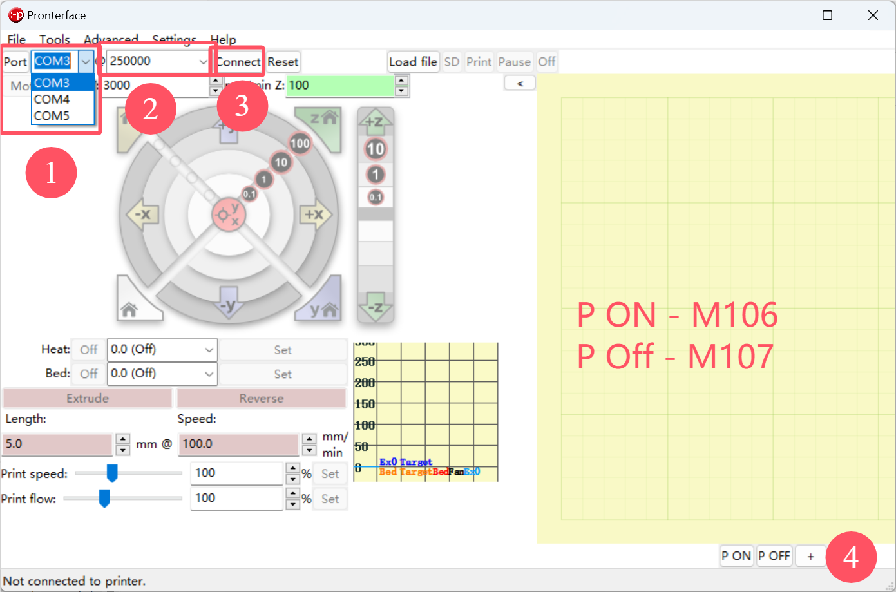

### 3. 扫描系统的配置

### 3.1 建立通讯

（1）网络环境设置：[电脑]，关闭Wi-Fi，只连接以太网

（2）确定局域网IP：[电脑]，Win+R打开cmd（命令提示符），输入arp -a，找到接口，确定IP地址前几位为192.168.0.xxx/或者192.168.1.xxx

（3）设置驱动器IP：

​	**方法1**：[驱动器]，在驱动器上用手柄控制进行设定：在传感器驱动器上：设定IP地址为192.168.0.xxx/或192.168.1.xxx（一般为101，如果101连不上，可以改为102，以此类推），重启设备，等待一会（更新配置），注意不要保持在环境设置的界面。

​	**方法2**：[电脑]，使用USB连接后用LJ-Navigator进行设置。打开LJ-Navigator，选择合适的预设文件，然后选择好通讯方式（USB），接着接收设置。然后参考方法1进行IP地址的设置，完成后发送设置后重启即可。


（4）软件设置：[电脑]，打开LJ-Navigator进行通讯设定。

- 打开LJ-Navigator后，选择使用默认设置，然后选择对应的激光轮廓传感器（如G015）：
- 通讯设定→PC通讯设定：选择通过以太网通讯，然后选择链接控制器，再点击检查控制器，稍等，然后点击下拉菜单，从而刷新局域网内的设备，若出现了刚才设定的IP则说明设定成功（传感器已经成功连入局域网）
- 点击Receive settings from controller，读取驱动器设定，从而测试连接。


### 3.2 截面获取

#### 方法1：LJ-Navigator软件

1. 点击View profile，点击开始预览，从而获取显示扫描图像
2. 点击CSV output，输出800个z坐标信息（单位为mm，但会有错误点，错误点用-999.999表示，需剔除错误点）


#### 方法2：MATLAB代码处理数据信息（相关代码在下一节介绍）

1. 在cmd中输入arp -a, 确定已经找到设定的IP（如果找不到的话：打开LJ-Navigator软件，测试能够正常通讯和查看截面，然后关闭软件）

2. 关闭所有程序和窗口

3. 在MATLAB中使用编写的函数通讯，处理数据，绘制截面。其中函数的语法为：

   `[coordinate,profile]=LJ_G5000_v1_2(ip,a)`

   其中：

   profile 是轮廓上各个点的高度数据，该数据为16位带符号的二进制数，最高位用于表示符号，后面15位用于表示数值，因此最大为
   $$
   2^{15}=32768
   $$
   ip地址是传感器的ip地址，例如’196.168.1.101’

   指令号是要对驱动器进行的操作，包括返回轮廓数据、测量值等。目前仅支持返回单测头轮廓数据，格式为Pk，其中k为测头序号。目前仅能使用’P1’指令。

   | 变量       | 含义          | 备注                                       |
   | ---------- | ------------- | ------------------------------------------ |
   | a          | 指令          |                                            |
   | 'Pk'       | 轮廓输出      | LJ_G5000_v1_2('192.168.1.101','P1')        |
   | ~~'Ma'~~   | 测量输出      | LJ_G5000_v1_2('192.168.1.101','M12345678') |
   | ~~'Q1'~~   | 通讯模式      | LJ_G5000_v1_2('192.168.1.101','Q1')        |
   | ~~'R0'~~   | 测量模式      | LJ_G5000_v1_2('192.168.1.101','R0')        |
   | coordinate | 轮廓横坐标(X) | 单位um                                     |
   | profile    | 轮廓纵坐标(Z) | 单位um                                     |

示例：

```matlab
[coordinate,profile] = LJ_G5000_v1_2('192.168.1.101','P1'); % 获取截面数据
plot(coordinate,profile) % 绘制截面形状
```


### 3.3 使用技巧

**（1）在建立链接时找不到激光位移传感器的IP地址**

​	①在激光轮廓传感器中设置IP地址，注意，需要避开当前已占用的IP地址；设置完成后重启控制器，以更新配置；如果还未找到IP地址，则进行下一步；

​	②打开LJ-Navigator，配置通讯设定并读取控制器设置，完成后在命令行中应该能够通过arp -a 刷新出控制器的IP地址。需要注意的是，使用LJ-Navigator时会占用TCPIP端口，如果需要在MATLAB中使用，则需要先退出该软件。

## 七、程序和代码

### 1. 截面获取

Matlab App Installation Package: [LJ_G5000_v1_2.mlappinstall](<Docs\LJ_G5000_v1_2.mlappinstall>) 

**（1）安装**：双击安装包即可，安装后可以在附加管理器中找到文件目录：


**（2）使用**：

​	LJ_G5000_V1_2在上一节已经说过用法，在这不赘述。

​	LJ_G5000_V2_2：在使用这个函数前，需要先自行建立全局(global)tcpip对象t，才能正常使用，调用时不需要再输入IP，直接输入指令即可。

**（3）说明**：

​	两个函数都是基于LJG5000以太网通讯协议（ [01 LJG5000_LAN.pdf](Docs\01 LJG5000_LAN.pdf) ）文件编写的，LJ_G5000_V1_2的处理基本流程包括：建立TCPIP对象→建立通讯→**发送指令→接收数据→处理数据**→断开通讯→清除TCPIP对象，LJ_G5000_V2_2的目的是为了避免多次调用时，频繁建立和断开通讯，造成时间上的浪费，因此只保留了上述加粗部分的环节。

​	特别的，如果使用的打印机可以通过串口Serial Port进行通讯，并进行运动控制。就可以以此控制打印机运动→获取截面的循环，从而获得三维轮廓。

## 八、Example (How to use)
### （1）打印一个立方体
### （2）获得一个截面轮廓
### （3）按照指定轨迹获取轮廓
### （4）设计打印轨迹并在打印后扫描，然后输出点云文件

# 参考文献

