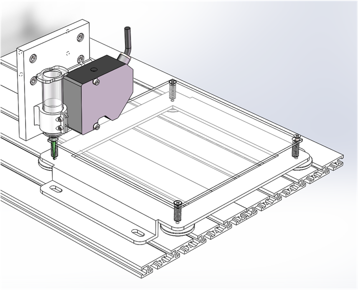

# Extrusion 3D printer with integrated laser profile sensor - in NUS

## 1 Introduction

A 2D Laser profile sensor is integrated to a 3D printer to achieve 3D scan,which is shown below.

The system is consist of sensor, motion control platform and pneumatic extrusion system. They are connected to a PC via Ethernet or Serial Port.

Printing Gcode are generated by open source Slicer software, and are read and sent by a open sourece user interface software.

When Printing, command are sent by PC via serial port to control board, and are decoded and executed on the board.

A set of programme are built to enable scanning function in matlab.

When scanning, it is necessary to coordinate the motion and the sensor. The PC controls the motion platform to move a step through the serial port, and then communicates with the sensor through Ethernet to obtain the cross section. This cycle continues until the scan is completed. 

Fig.1 System Diagram

## 2 Structure

This section will introduce the main structures within the system.

### (1) Motion Control Platform
运动控制平台是一个三轴钻床的基础上改装的。

图2 运动平台（原始）

定制了如下组件：

图3 改造示意图

#### 1）安装板
介绍：安装在Z轴滑板上的安装板，将注射器针筒和2D轮廓传感器安装在它上面。
制造：3D打印（FDM），工程塑料。
模型：[click to get stl file](<3Dmodels/STL/安装板 - PlanB.STL>)
#### 2）底座组件
介绍：由基板、调节装置和底座构成。
制造：底座材料为不锈钢，通过激光切割和折弯制造。其余部件可直接采购。
模型：[click to get stl file](<3Dmodels/STL/安装板 - PlanB.STL>)

图4 运动平台（改造后）

### (2) Extrusion System
挤出系统由气压分配器和挤出装置构成。气泵可根据实验室条件选购。
#### 1）气压分配器
图5 气压分配器
介绍：找一下说明书。
操作：
    a. 调压：通过调节黑色旋钮调节气压
    b. 开关：可以按下左侧红色小按钮进行手动调节，也可以外接踏板手动调节（这个接口被改造用于程序控制）；控制方式在手册中有详细说明。
手册：链接
### (3) 2D laser profile sensor
图6 激光轮廓传感器
使用的是基恩士2D激光轮廓传感器，驱动器型号为LJ-G5000，传感器型号为LJ-G030.
测量原理：
Z向测量范围：侧头下方XXXX；X向测量范围：
Z向测量精度：；X向测量精度。
通讯方式：USB、串口、以太网。其中只有以太网通讯可以定制化传输轮廓数据。
其他详情参见手册。
手册：
以太网通讯协议：
## 3 Hardware
这一节主要介绍接线和相关电路。
### (1) Control borard
图7 控制板接口图
使用的控制板品牌为：，型号为：。
控制板相关信息的网页：。
芯片为：。
支持的固件包括：。

### (2) Sensor Driver
图8 激光轮廓传感器驱动器
激光轮廓传感器需要接电源，电压为，接线方式为。

### (3) Power
图9 直流电源
24V XXW直流电源

### (4) Step Motors
57步进电机
其接线方式如下：

图9 步进电机接线图

### (5) Endstops
光电传感器，型号
手册：

图10 限位开关接线图

### (6) Hotbed
热床尺寸为

图11 热床接线图

### (4) Pressure switch control
气压开关控制由电磁继电器实现，其接线图如下：

图12 气压开关控制接线图

## 4 Firmware - Marlin
Marlin是最常用的开源3D打印固件，我们对其进行了相应修改，以满足设备使用：

XXXXXX

Marlin官网：
原始Marlin资源：
定制Marlin资源：

## 5 Software
这里分享使用的相关软件：

### （1）切片软件
#### 1）Slic3r
Slic3r是款开源切片软件，但是其已经停止开发了，所以存在一些bug。
官网：
图13 Slic3r界面
#### 2）sssss
是Slic3r的一个分支，目前仍然在开发，并且其社区相对活跃。

图14 Slic3r界面

### （2）用户界面：Printerun
官网：

图15 界面

### （3）LJ-Navigator
基恩士激光轮廓传感器的官方软件，可以用来测试传感器和配置相关参数。

图16 界面

### （4）CAXA 电子图版 2018 （中文版）
用于绘制打印、扫描轨迹。

## 6 Programme

## 7 Example (How to use)
### （1）打印一个立方体
### （2）获得一个截面轮廓
### （3）按照指定轨迹获取轮廓
### （4）设计打印轨迹并在打印后扫描，然后输出点云文件
