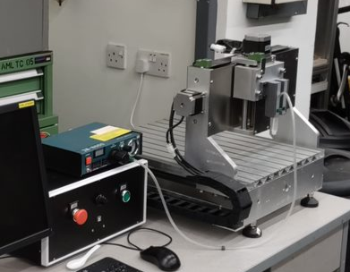

# Extrusion 3D printer with integrated laser profile sensor - in NUS

## 1 简介 Introduction

2D激光轮廓传感器集成到3D打印机中以实现3D扫描，如下所示。

A 2D Laser profile sensor is integrated to a 3D printer to achieve 3D scan,which is shown below. 

该系统由传感器、运动控制平台和气动挤压系统组成，通过以太网或串口与PC机连接。

The system is consist of sensor, motion control platform and pneumatic extrusion system. They are connected to a PC via Ethernet or Serial Port. 

打印Gcode由开源Slicer软件生成，并由开源用户界面软件读取和发送。

Printing Gcode are generated by open source Slicer software, and are read and sent by a open sourece user interface software.

打印时，命令由PC通过串口发送到控制板，在控制板上解码并执行。

When Printing, command are sent by PC via serial port to control board, and are decoded and executed on the board.

在matlab中编写了一套实现扫描功能的程序。

A set of programme are built to enable scanning function in matlab.

扫描时需要运动与传感器的协调，PC通过串口控制运动平台移动一步，再通过以太网与传感器通讯获取截面，如此循环直至扫描完成。

When scanning, it is necessary to coordinate the motion and the sensor. The PC controls the motion platform to move a step through the serial port, and then communicates with the sensor through Ethernet to obtain the cross section. This cycle continues until the scan is completed. 

图1 系统框图 Fig.1 System Diagram

### 如何从0开始搭建整个系统呢？

1. 购买/制造相应的组件，并按照设计进行装配
2. 确定各个端子的对应情况，并完成接线
3. 完成PC的环境准备、打印系统和扫描系统的配置
   1. 电脑环境的准备
   2. 打印和挤出系统的配置
   3. 扫描系统的配置

## 2 结构 Structure

本节将介绍系统内部的主要结构。

This section will introduce the main structures within the system.

### (1) 运动控制平台 Motion Control Platform
运动控制平台是一个三轴钻床的基础上改装的。
The motion control platform is modified based on a three-axis drilling machine.

图2 运动平台（原始） Figure 2 Motion platform (original)

定制了如下组件 The following components are customized:

图3 改造示意图 Figure 3 Schematic diagram of transformation

#### 1）安装板 Mounting Plate
介绍：安装在Z轴滑板上的安装板，将注射器针筒和2D轮廓传感器安装在它上面。

Introduction: The mounting plate mounted on the Z-axis slide, the syringe barrel and 2D profile sensor are mounted on it.

制造：3D打印（FDM），工程塑料。

Manufacturing: 3D printing (FDM), engineered plastics.

模型 3D Model：[click to get stl file](<3Dmodels/STL/安装板 - PlanB.STL>)

#### 2）底座组件 Base assembly

介绍：由基板、调节装置和底座构成。

Introduction: It consists of a base plate, an adjustment device and a base.

制造：底座材料为不锈钢，通过激光切割和折弯制造。其余部件可直接采购。

Manufacturing: The base is made of stainless steel, manufactured by laser cutting and bending. The remaining parts can be purchased directly.

模型 3D Model：[click to get stl file](<3Dmodels/STL/底座.STL>)

图4 运动平台（改造后） Figure 4 Motion platform (after transformation)

装配体 Assembly：[click to get stl file](<3Dmodels\STP\Assembly - Carriage-Z.STEP>)

### (2) Extrusion System
挤出系统由气压分配器和挤出装置构成。气泵可根据实验室条件选购。
#### 1）气压分配器 Pressure Dispenser

图5 气压分配器

##### 技术指标：
1. 吐出方式：16种自由设定方式、带吐出时间显示*
2. 自动定时吐出：00.01S-99.99S
3. 吐出间隔时间：0.1-9.9S（自动定时功能）
4. 输入电压：220V±10% 50Hz/110V±10% 60Hz
5. 内部电压：12VDC/24VDC
6. 输入气压：10-100pSi
7. 输出气压：1-80 pSi
8.  外形尺寸：235×225×63mm
9.  重量：2.8kg
##### 使用安装说明:
位于背部的SETUP四位吐出时间编程器拨码开关，通过拨动其可作16种出方式选择模式组合设定如下：
<table>
<capital>模式组合</capital>
<tr>
<th rowspan=2 align="center">序号</th>
<th colspan=4 align="center"> 模式开关状态</th>
<th rowspan=2 align="center">吐出方式及工作对应功能</th>
</tr>
<tr>
<th align="center">S1</th>
<th align="center">S2</th>
<th align="center">S3</th>
<th align="center">S4</th>
</tr>
<tr>
<th align="center">1</th>
<th align="center">Off</th>
<th align="center">Off</th>
<th align="center">Off</th>
<th align="center">Off</th>
<th align="left">  点动模式，按下/踩下并保持以维持挤出</th>
</tr>
<tr>
<th align="center">2</th>
<th align="center">On</th>
<th align="center">Off</th>
<th align="center">On</th>
<th align="center">On</th>
<th align="left">  保持模式，按下/踩下1次开关，按照设定的时间持续挤出；再按下/踩下1次开关停止挤出。</th>
</tr>
<tr>
<th align="center">3</th>
<th align="center">Off</th>
<th align="center">On</th>
<th align="center">On</th>
<th align="center">On</th>
<th align="left">  点动计时模式，按下/踩下并保持以维持挤出设定的时间</th>
</tr>
<tr>
<th align="center">4</th>
<th align="center">On</th>
<th align="center">On</th>
<th align="center">On</th>
<th align="center">On</th>
<th align="left">  按照设定的时间自动定时连续挤出</th>
</tr>
<tr>
<th align="center">5</th>
<th align="center">On</th>
<th align="center">Off</th>
<th align="center">Off</th>
<th align="center">Off</th>
<th align="left">  按下/踩下1次开关，按设定时间挤出1次。</th>
</tr>
<tr>
<th align="center">6</th>
<th align="center">Off</th>
<th align="center">On</th>
<th align="center">Off</th>
<th align="center">Off</th>
<th align="left">  按下/踩下1次开关，按设定时间挤出2次。</th>
</tr>
<tr>
<th align="center">7</th>
<th align="center">On</th>
<th align="center">On</th>
<th align="center">Off</th>
<th align="center">Off</th>
<th align="left">  按下/踩下1次开关，按设定时间挤出3次。</th>
</tr>
<tr>
<th align="center">8</th>
<th align="center">Off</th>
<th align="center">Off</th>
<th align="center">On</th>
<th align="center">Off</th>
<th align="left">  按下/踩下1次开关，按设定时间挤出4次。</th>
</tr>
<tr>
<th align="center">9</th>
<th align="center">On</th>
<th align="center">Off</th>
<th align="center">On</th>
<th align="center">Off</th>
<th align="left">  按下/踩下1次开关，按设定时间挤出5次。</th>
</tr>
<tr>
<th align="center">10</th>
<th align="center">Off</th>
<th align="center">On</th>
<th align="center">On</th>
<th align="center">Off</th>
<th align="left">  按下/踩下1次开关，按设定时间挤出6次。</th>
</tr>
<tr>
<th align="center">11</th>
<th align="center">On</th>
<th align="center">On</th>
<th align="center">On</th>
<th align="center">Off</th>
<th align="left">  按下/踩下1次开关，按设定时间挤出7次。</th>
</tr>
<tr>
<th align="center">12</th>
<th align="center">Off</th>
<th align="center">Off</th>
<th align="center">Off</th>
<th align="center">On</th>
<th align="left">  按下/踩下1次开关，按设定时间挤出8次。</th>
</tr>
<tr>
<th align="center">13</th>
<th align="center">On</th>
<th align="center">Off</th>
<th align="center">Off</th>
<th align="center">On</th>
<th align="left">  按下/踩下1次开关，按设定时间挤出9次。</th>
</tr>
<tr>
<th align="center">14</th>
<th align="center">Off</th>
<th align="center">On</th>
<th align="center">Off</th>
<th align="center">On</th>
<th align="left">  按下/踩下1次开关，按设定时间挤出10次。</th>
</tr>
<tr>
<th align="center">15</th>
<th align="center">On</th>
<th align="center">On</th>
<th align="center">Off</th>
<th align="center">On</th>
<th align="left">  按下/踩下1次开关，按设定时间挤出11次。</th>
</tr>
<tr>
<th align="center">16</th>
<th align="center">Off</th>
<th align="center">Off</th>
<th align="center">On</th>
<th align="center">On</th>
<th align="left">  按下/踩下1次开关，按设定时间挤出12次。</th>
</tr>
</table>

##### 操作：
1. 调压：通过调节黑色旋钮调节气压
2. 开关：可以按下左侧红色小按钮进行手动调节，也可以外接踏板手动调节（这个接口被改造用于程序控制）；控制方式在手册中有详细说明。
##### 参考资料
1. [手册](Docs/JND-983A点胶机详细功能设置.docx)

#### 2） 注射器针筒
##### 三维模型
1. 针筒
2. 喷嘴
3. 装配体

### (3) 2D激光轮廓传感器 2D laser profile sensor

图6 激光轮廓传感器 Figure 6 Laser profile sensor

#### 详情：
使用的是基恩士2D激光轮廓传感器，驱动器型号为LJ-G5000，传感器型号为LJ-G030.

The sensor used is a KEYENCE 2D laser profile sensor, the driver model is LJ-G5000, and the sensor model is LJ-G030.

#### 测量原理：

Z向测量范围：侧头下方XXXX；X向测量范围：

Z向测量精度：X向测量精度。

#### 通讯方式：
USB、串口、以太网。其中只有以太网通讯可以定制化传输轮廓数据。其他详情参见手册。

Communication mode: USB, serial port, Ethernet. Only Ethernet communication can be customized to transmit profile data. For other details, please refer to the manual.

#### 相关资料：
1. [用户手册](<Docs/01 AS_79826_LJ-G_UM_96M13960_CN_1059-7.pdf>)
2. [以太网通讯协议](<Docs/01 LJG5000_LAN.pdf>)
3. [LJ-G015 3D模型](Docs/LJ-G015(K)_2.x_t)
4. [LJ-G030 3D模型](Docs/LJ-G030_2.x_t)

## 3 硬件 Hardware

这一节主要介绍接线和相关电路。

This section mainly introduces the wiring and related circuits.

### (1) 控制板 Control borard

图7 控制板接口图 Figure 7 Control panel interface diagram

使用的控制板品牌为：，型号为：。
控制板相关信息的网页：。
芯片为：。
支持的固件包括：。

### (2) 传感器驱动器 Sensor Driver

图8 激光轮廓传感器驱动器 Figure 8 Laser profile sensor driver

接线方式参见上图 See the figure above for wiring method：

①激光轮廓传感器需要接直流电源，电压为24V。The laser profile sensor needs to be connected to a DC power supply with a voltage of 24V.

②可接显示器(VGA)观察轮廓信息。Can be connected to a monitor (VGA) to observe profile information.

③以太网口连接到路由器上从而与PC连接。The Ethernet port is connected to the router and then connected to the PC.

④传感器连接线。Sensor connection cable.

### (3) 电源 Power

图9 直流电源 Figure 9 DC power supply

24V XXW直流电源

### (4) 步进电机 Step Motors
57步进电机 57 Stepper Motor
其接线方式如下：

图9 步进电机接线图 Figure 9 Stepper motor wiring diagram

### (5) 限位开关 Endstops
光电传感器，型号
手册：

图10 限位开关接线图 Figure 10 Limit switch wiring diagram

### (6) Hotbed
热床尺寸为

图11 热床接线图 Figure 11 Hot bed wiring diagram

### (4) Pressure switch control
气压开关控制由电磁继电器实现，其接线图如下：

The air pressure switch control is realized by an electromagnetic relay, and its wiring diagram is as follows:

图12 气压开关控制接线图 Figure 12 Air pressure switch control wiring diagram

## 4 Firmware - Marlin
Marlin是最常用的开源3D打印固件，我们对其进行了相应修改，以满足设备使用：

Marlin is the most commonly used open source 3D printing firmware, and we modified it accordingly to meet the needs of the device.

XXXXXX

Marlin官网：
原始Marlin资源：
定制Marlin资源：

## 5 软件 Software
这里分享使用的相关软件：

Here are the related software used:

### （1）切片软件 Slicing software
#### 1）Slic3r
Slic3r是款开源切片软件，但是其已经停止开发了，所以存在一些bug。

Slic3r is an open source slicing software, but it has stopped development, so there are some bugs.

官网：

图13 Slic3r界面

#### 2）sssss

是Slic3r的一个分支，目前仍然在开发，并且其社区相对活跃。

It is a fork of Slic3r and is still under development with a relatively active community.

图14 Slic3r界面

### （2）用户界面 user interface：Printerun

官网：

图15 界面

### （3）LJ-Navigator

基恩士激光轮廓传感器的官方软件，可以用来测试传感器和配置相关参数。

The official software of KEYENCE laser profile sensors can be used to test sensors and configure related parameters.

图16 界面

### （4）CAXA 电子图版 2018 （中文版）
用于绘制打印、扫描轨迹。

Used to draw print and scan tracks.

## 6 配置
### 电脑环境的配置
### 打印和挤出系统的配置
### 扫描系统的配置

## 7 程序和代码

## 8 Example (How to use)
### （1）打印一个立方体
### （2）获得一个截面轮廓
### （3）按照指定轨迹获取轮廓
### （4）设计打印轨迹并在打印后扫描，然后输出点云文件
